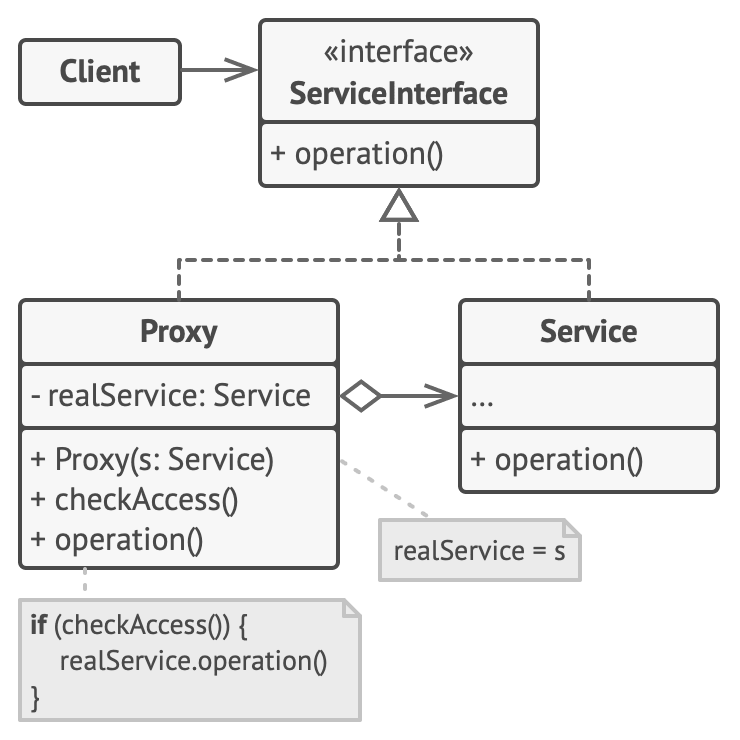

## Overview
본 객체 대신 프록시 객체를 먼저 거쳐서 사용하는 방법

출처: [Design pattern guru](https://refactoring.guru/design-patterns/proxy)


## Why to use?
- Lazy Loading <br></br>
생성시 많은 리소스가 필요할 때 유용
- 로깅
- 캐싱 <br></br>

## When to use?
- 본 객체에 대한 접근 제어가 필요할 때
- 로깅, 캐싱, 레이지 로딩 등 필요한 기능을 기존 코드 변경없이 <br></br>
OCP 원칙을 지키며 추가하고 싶을 때

## How to use?
프록시 객체를 정의한다. 이 때, Interface 타입 필드를 갖는 property 를 생성자 주입받을 수 있게 간다. <br></br>
이는 구현체 참조 변수를 유지하기 위한 것으로 데코레이터 패턴과 유사하다.

#### GameService.java
```java
public interface GameService {
    void loadGame() throws InterruptedException;
    void startGame();
}
```

#### DefaultGameService.java
```java
public class DefaultGameService implements GameService{
    public void loadGame() throws InterruptedException {
        System.out.println("게임 로딩중입니다.");
        // 1초 지연
        Thread.sleep(1000L);
        System.out.println("로딩 완료");
    }
    public void startGame() {
        System.out.println("게임 시작!");
    }
}
```

#### GameServiceProxy.java
```java
@Getter
@RequiredArgsConstructor(access = AccessLevel.PUBLIC)
public class GameServiceProxy implements GameService {
    private final GameService gameService;

    @Override
    public void loadGame() throws InterruptedException {
        // lazy Loading
//        if (gameService == null) {this.gameService = new DefaultGameService();}

        long before = System.currentTimeMillis();
        this.gameService.loadGame();
        long after = System.currentTimeMillis();
        System.out.println(after - before + "ms elapsed.");
    }

    @Override
    public void startGame() {
    }
}
```
#### GameServiceTest.java

```java
class GameServiceTest {
    @Test
    void loadGameTest() throws InterruptedException {
        // Constructor DI
        GameServiceProxy gameServiceProxy = new GameServiceProxy(new DefaultGameService());
        gameServiceProxy.loadGame();
    }
}
```

#### 실행결과
```text
게임 로딩중입니다.
로딩 완료
1002ms elapsed.
```

> 📝 게임 서비스 구현체 코드를 전혀 건드리지 않고 <br></br>
(클라이언트 코드의 변경 없이 (main , 호출부)) <br></br>
변경에 닫혀있고, 확장에 열려있는 OCP 원칙을 지키며 메소드 실행 소요시간을 측정한다.<br></br>

## Class Diagram


## Pros and Cons
### 장점
- 기존 코드(구현체, 클라이언트) 변경없이 프록시 객체 추가만으로 추가기능 구현 가능. <br></br>
ex) 지연로딩, 캐싱, 시간측정, 로깅

### 단점
- 코드 복잡도 증가

---
## 🔗 Reference
[GoF 디자인 패턴 - 백기선](https://www.inflearn.com/course/%EB%94%94%EC%9E%90%EC%9D%B8-%ED%8C%A8%ED%84%B4/dashboard)
