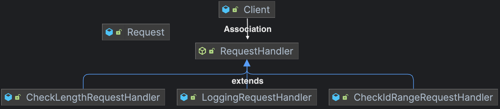

import Tabs from '@theme/Tabs';
import TabItem from '@theme/TabItem';

## Overview


## When to use
- 요청 유효성 검사<br></br>
하나의 요청에 대해 여러 단계의 validation 을 할 때
- 일정한 순서로 단일 책임을 갖는 핸들러 역할을 하도록 할 때 <br></br>
**순서를 거스르거나 일정 단계 핸들러에서 연쇄를 중단할 수도 있다.**

## Why to use
요청자(클라이언트)가 처리자(핸들러)와 분리된 체로 요청할 수 있게 하기 위해.

## How to use
클라이언트가 일종의 요청 포맷(Request : id, body) 을 가지고 <br></br>
Handler 에 요청을 보내면 ID 범위 체크, Body 길이 체크, 로깅을 담당하는 총 3개의 핸들러가 <br></br>
연쇄적으로 요청 유효성 검사를 실행하는 프로그램을 책임 연쇄 패턴을 통해 구현해보자.

### Client
#### Client.java
```java
@RequiredArgsConstructor
public class Client {

    private final RequestHandler requestHandler;

    public void validateRequest(Request request) {
        this.requestHandler.handle(request);
    }
}
```

#### Request.java
```java
@Getter
@RequiredArgsConstructor
public class Request {

    private final int id;
    private final String body;
}
```

### Handler
<Tabs>
<TabItem value="abstract" label="RequestHandler.java">

```java
@RequiredArgsConstructor
public abstract class RequestHandler {
    private final RequestHandler nextHandler;

    public void handle(Request request) {
        if (this.nextHandler == null) return;
        this.nextHandler.handle(request);
    }
}
```

</TabItem>
<TabItem value="check-1" label="CheckIdRangeRequestHandler.java">

```java
public class CheckIdRangeRequestHandler extends RequestHandler {
    public CheckIdRangeRequestHandler(RequestHandler nextHandler) {
        super(nextHandler);
    }

    @Override
    public void handle(Request request) {
        var id = request.getId();
        if (id <= 0 || id >= 10) throw new IllegalArgumentException("Request Id should be in [1,10]");

        super.handle(request);
    }
}
```
</TabItem>
<TabItem value="check-2" label="CheckLengthRequestHandler.java">

```java
public class CheckLengthRequestHandler extends RequestHandler {
    public CheckLengthRequestHandler(RequestHandler nextRequestHandler) {
        super(nextRequestHandler);
    }

    @Override
    public void handle(Request request) {
        if (request.getBody().length() > 10) {
            throw new IllegalArgumentException("You should request body length <= 10");
        }
        super.handle(request);
    }
}
```
</TabItem>
<TabItem value="logging" label="LoggingRequestHandler.java">

```java
@Slf4j
public class LoggingRequestHandler extends RequestHandler{
    public LoggingRequestHandler(RequestHandler requestHandler) {
        super(requestHandler);
    }

    @Override
    public void handle(Request request) {
        log.info("request id: " + request.getId());
        log.info("body: " + request.getBody());
        super.handle(request);
    }
}
```
</TabItem>
</Tabs>

### Test
#### ClientTest.java
```java
class ClientTest {

    // Chaining 순서
    // ID 체크 -> Body 길이 체크 => Logging
    private final RequestHandler chainHandler = new CheckIdRangeRequestHandler(new CheckLengthRequestHandler(new LoggingRequestHandler(null)));
    
    @DisplayName("Success request")
    @Test
    void successRequestHandleTest() {
        Request request = new Request(5, "khazix");
        Client client = new Client(chainHandler);
        // 성공
        client.validateRequest(request);
    }

    @DisplayName("ID 범위 실패 테스트")
    @Test
    void failCheckIdRangeHandle() {
        Request request = new Request(0, "khazix");
        Client client = new Client(chainHandler);
        // ID check 단계에서 종료
        assertThrows(IllegalArgumentException.class, ()->client.validateRequest(request));
    }


    @DisplayName("Body 길이 범위 실패 테스트")
    @Test
    void failCheckBodyLengthHandle() {
        Request request = new Request(0, "khazix vladimir rumble");
        Client client = new Client(chainHandler);
        // Body Length 단계에서 종료
        assertThrows(IllegalArgumentException.class, ()->client.validateRequest(request));
    }
}
```

> 💡Client 는 RequestHandler 의 구현체를 몰라도 된다.

### Diagram


## Pros and Cons
### 장점
- Client 코드와 Handler 가 분리되어있어 Handler 구현체 변경에 영향받지 않는다. (OCP)
- Handler 구현체가 단일 책임을 갖는다. (SRP)
- Handler 체이닝 순서 구성이 자유롭다.

### 단점
- 디버깅이 까다로워진다. <br></br>
Handler 체이닝 방식에 따라 코드 흐름이 복잡해지기 때문이다.

---

## 🔗 Reference
[코딩으로 학습하는 GoF의 디자인 패턴 - 백기선](https://www.inflearn.com/course/%EB%94%94%EC%9E%90%EC%9D%B8-%ED%8C%A8%ED%84%B4)