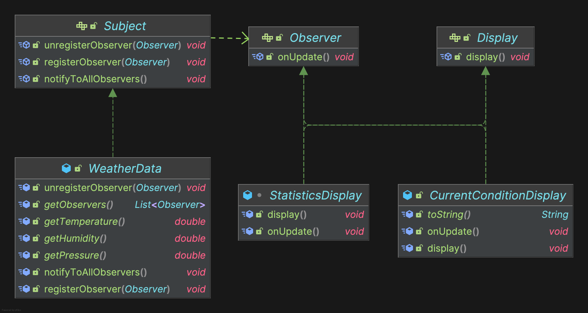

## Overview


## When to use
특정 객체의 상태가 변경될 때 다른 객체에게 알림을 전달해야 할 때
- 버튼 클릭시 Display 업데이트
- 이벤트 발생시 Display 업데이트

## Why to use

## How to use
Subject (주제) 와 Observer (관찰자)로 구성한다. \
예제의 Display 는 보통 옵저버 패턴이 Button + Event Listener (옵져버) 에서 자주 쓰이고 \
이벤트 리스너가 화면 변경 역할도 한다고 가정해서 추가한 인터페이스다.


### Interface 

<Tabs>

<TabItem value="subject" label="Subject">

```java
public interface Subject {
  void registerObserver(Observer observer);
  void unregisterObserver(Observer observer);
  void notifyToAllObservers();
}
```

</TabItem>

<TabItem value="observer" label="Observer">

```java
public interface Observer {
  void onUpdate();
}
```

</TabItem>
<TabItem value="displat" label="Display">

```java
public interface Display {
  void display();
}
```

</TabItem>
</Tabs>

### Concrete Class
<Tabs>
<TabItem value="conditionDisplay" label="ConditionDisplay">

```java
@Slf4j
@ToString
public class CurrentConditionDisplay implements Observer, Display {
  private final WeatherData weatherData;
  private double currentTemperature;
  private double currentHumidity;

  public CurrentConditionDisplay(WeatherData weatherData) {
    this.weatherData = weatherData;
    this.currentTemperature = weatherData.getTemperature();
    this.currentHumidity = weatherData.getHumidity();
    weatherData.registerObserver(this);
  }

  @Override
  public void display() {
    log.info(this.toString());
  }

  @Override
  public void onUpdate() {
    if (weatherData.getTemperature() == this.currentTemperature &&
      weatherData.getHumidity() == this.currentHumidity) {
      return;
    }
    this.currentTemperature = this.weatherData.getTemperature();
    this.currentHumidity = this.weatherData.getHumidity();
    this.display();
  }
}
```

</TabItem>

<TabItem value="statistics" label="Statistics">
</TabItem>

```java
@Slf4j
class StatisticsDisplay implements Display, Observer {
  // It's not required to removeObserver from WeatherData since display always exist with the weatherData.
  private final WeatherData weatherData;
  private double totalTemperature;
  private double maxTemperature;
  private double minTemperature;
  private double avgTemperature;
  private int count = 0;

  public StatisticsDisplay(WeatherData weatherData) {
    this.weatherData = weatherData;
    weatherData.registerObserver(this);
  }

  @Override
  public void display() {
    log.info("Max temperature: {}, Avg temperature: {}, Min temperature: {}", this.maxTemperature, this.avgTemperature, this.minTemperature);
  }

  @Override
  public void onUpdate() {
    this.totalTemperature += weatherData.getTemperature();
    this.maxTemperature = Math.max(maxTemperature, weatherData.getTemperature());
    this.minTemperature = Math.min(minTemperature, weatherData.getTemperature());
    this.count++;
    this.avgTemperature = totalTemperature / count;
    this.display();
  }
}
```

</Tabs>

### Push 방식
Subject 가 Observer 에게 데이터를 직접 전달한다.
### Polling 방식
이벤트 발생시 Observer 가 필요한 데이터를 Subject 에게 요청한다.

:::tip
📝 **Polling 방식을 사용하라. Subject 변경에 유연하고, 필요한 데이터만 접근한다.**
:::

## Pros and Cons
### Pros
- 동기식으로 구현하면 디버깅이 쉽다.

### Cons
- Pub/Sub 패턴에 비해 객체간 의존성 강결합이 발생한다. <br></br>
Observer - Subject 간의 의존성이 강하다.
