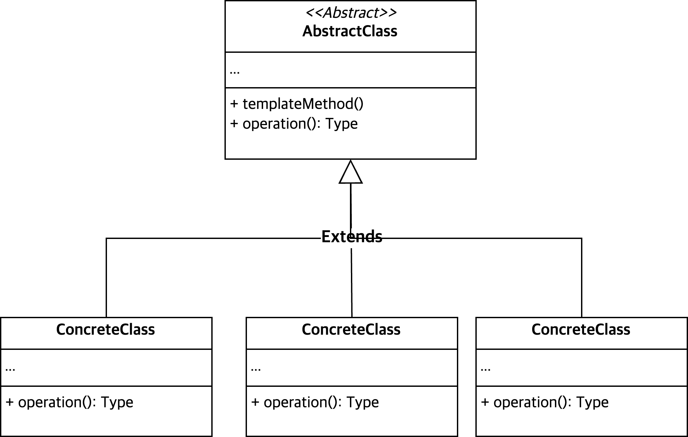
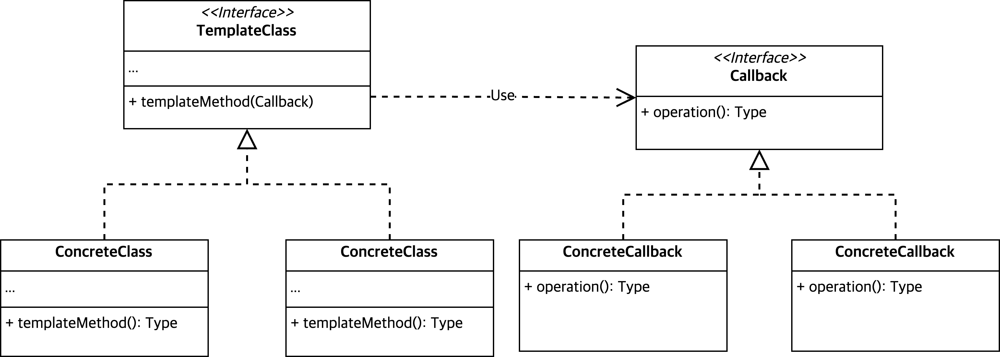

import Tabs from '@theme/Tabs';
import TabItem from '@theme/TabItem';

## Overview
Abstract Class 는 템플릿 메소드를 제공하고  <br></br>
하위 클래스는 구체적인 행위를 정의한다.



## Why to use
코드를 재사용하고 구체적인 행위만 분리할 수 있다.

## When to use
공통된 로직을 그대로 두고 차이가 존재하는 메소드만 분리하여 SRP / OCP 를 지키고자 할 때.


## Pros and Cons
### Pros
- 템플릿 코드 재사용 <br></br>
코드 중복 제거
- SRP / OCP 준수

### Cons
- 리스코프 치환 원칙 위배 위험  <br></br>
인터페이스 시그니처만 지키고, 실제 동작은 원래 의도와 다르게 이뤄질 수 있다.
- 템플릿을 제외한 메소드가 많아질 수록 템플릿 메소드가 복잡해질 수 있다.

> 추상 클래스 템플릿 메소드에 `final` 키워드를 사용하여 Override 를 방지하라.

## Example

<Tabs>
<TabItem value="abstract" label="AbstractFileProcessor.java">

```java
abstract class AbstractFileProcessor {
  final public int process(String filePath) throws FileNotFoundException {
    try (BufferedReader br = new BufferedReader(new FileReader(filePath))) {

      OptionalInt result = br.lines()
        .mapToInt(Integer::parseInt)
        .reduce(this::calculate);

      if (result.isEmpty()) throw new IllegalStateException("The file has no content");
      return result.getAsInt();

    } catch (IOException e) {
      throw new FileNotFoundException(e.getMessage());
    }
  }

  abstract protected int calculate(int prevValue, int nextValue);
}

```

</TabItem>
<TabItem value="PlusFileProcessor" label="PlusFileProcessor.java">

```java
class PlusFileProcessor extends AbstractFileProcessor {
  @Override
  protected int calculate(int prevValue, int nextValue) {
    return prevValue + nextValue;
  }
}

```

</TabItem>
<TabItem value="MultiplyFileProcessor" label="MultiplyFileProcessor.java">

```java
class MultiplyFileProcessor extends AbstractFileProcessor {
  @Override
  protected int calculate(int prevValue, int nextValue) {
    return prevValue * nextValue;
  }
}
```

</TabItem>
</Tabs>

# Template Callback Pattern

## Overview



## Example (2)

<Tabs>
<TabItem value="Operation" label="Operation.java">

```java
public interface Operation<T> {
  T operate(T accumulator, T currentValue);
}]
```
</TabItem>

<TabItem value="templateInterface" label="FileProcessor.java">

```java
interface FileProcessor<T> {
  T process(String filePath, Operation<T> operation) throws FileNotFoundException;
}

```
</TabItem>
<TabItem value="SingletonOperation" label="SingletonIntOperation.java">

```java
@RequiredArgsConstructor
enum SingletonIntOperation implements Operation<Integer> {
  PLUS((accumulator, currentValue)-> accumulator + currentValue),
  MULTIPLY((accumulator, currentValue)-> accumulator * currentValue);

  private final BiFunction<Integer, Integer, Integer> operation;

  @Override
  public Integer operate(Integer accumulator, Integer currentValue) {
    return this.operation.apply(accumulator, currentValue);
  }
}

```

</TabItem>
<TabItem value="IntegerFileProcessor" label="IntegerFileProcessor.java">

```java
public class IntegerFileProcessor implements FileProcessor<Integer> {
  @Override
  public Integer process(String filePath, Operation<Integer> operation) throws FileNotFoundException {
    try (BufferedReader br = new BufferedReader(new FileReader(filePath))) {

      OptionalInt result = br.lines()
        .mapToInt(Integer::parseInt)
        .reduce(operation::operate);

      if (result.isEmpty()) throw new IllegalStateException("The file has no content");
      return result.getAsInt();

    } catch (IOException e) {
      throw new FileNotFoundException(e.getMessage());
    }
  }
}

```

</TabItem>
</Tabs>
