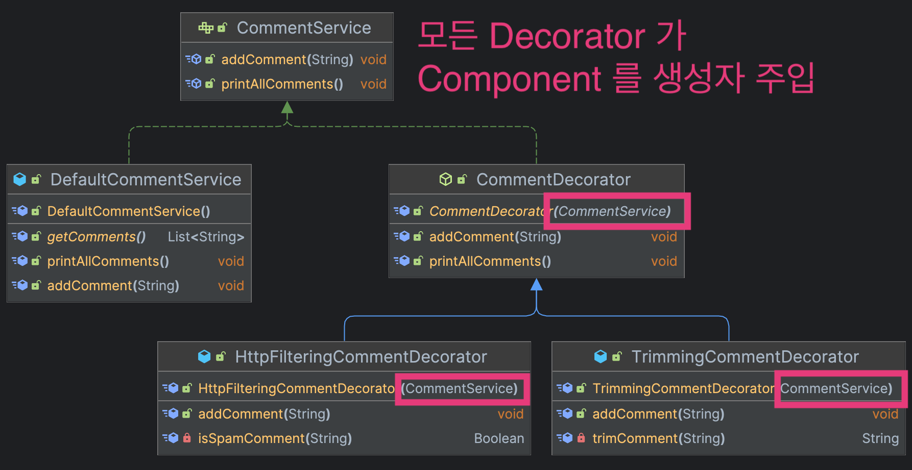

## Overview
📝 **데코레이터 패턴은 동적으로 런타임에 부가기능을 추가할 수 있게하는 디자인 패턴이다.**

## When to use

특정 사용자 (Client) 가 댓글을 다는 서비스가 있다고 하자. <br></br>
이 때, 댓글 끝에 붙은 ".." 같은 문자열은 자동으로 trim 처리가 필요하다는 요구사항이 있어
TrimmingCommentService 클래스를 상속받아 구성했다.
#### Client.java
```java
@Component
@Getter
public class Client {
    private CommentService commentService;

    @Autowired
    public Client(CommentService commentService) {
        this.commentService = commentService;
    }

    public void writeComment(String comment) {
        commentService.addComment(comment);
    }
}
```

#### CommentService.java
```java
@Component
public class CommentService {
    private List<String> comments = new ArrayList();

    public void addComment(String comment) {
        this.comments.add(comment);
    }
}
```

#### TrimmingCommentService.java
```java
public class TrimmingCommentService extends CommentService {

    @Override
    public void addComment(String comment) {
        super.addComment(getTrimmedComment(comment));
    }

    // 분명 클라이언트 코드 변경 없이 새로운 기능 확장을 도모했지만
    // Compile time 에 이미 이 기능을 완벽히 fix 해야만 한다는게 단점이다.
    // 유연하지 않다. Runtime 시에 바꿔야한다면?
    private String getTrimmedComment(String comment) {
        return comment.replace("..","");
    }
}
```

**현재까지의 구현 내역을 클래스 다이어그램으로 표현하면 다음과 같다.**


클라이언트에선 다음과 같이 Trimming 된 댓글을 작성하는 서비스를 사용할 수 있을 것이다.
#### ClientCommentTest.java
```java
import m.falcon.designpattern.domain.comment.service.TrimmingCommentService;
import org.junit.jupiter.api.DisplayName;
import org.junit.jupiter.api.Test;

import static org.assertj.core.api.Assertions.*;

class ClientCommentTest {

    @DisplayName("댓글 달기 .. 제거 테스트")
    @Test
    void writeTrimCommentTest() {
        // 생성자 DI
        // highlight-start
        // 만약, spam filtering 이 필요하다면?
        Client client = new Client(new TrimmingCommentService());
        // highlight-end
        client.writeComment("..카르마..");

        String trimmedComment = "카르마";
        assertThat(client.getCommentService().getComments().get(0)).isEqualTo(trimmedComment);
    }
}
```

### 문제점
만약 "Http" 가 포함된 댓글 작성을 방지하는 필터링이 필요하다면 어떻게 해야할까? <br></br>
**상속을 통해 SpamFilteringCommentService 를 구현하면 될 것이다.**

#### HttpFilterCommentService.java
```java
public class HttpFilterCommentService extends CommentService {

    /**
     * http 프로토콜은 지원하지 않음.
     * @param comment
     */
    @Override
    public void addComment(String comment) {
        if (isSpamComment(comment)) {
            return;
        }
        super.addComment(comment);
    }

    private Boolean isSpamComment(String comment) {
        return comment.contains("http://");
    }
}
```

그렇다면 클라이언트는 생성자 주입을 다음과 같이 변경하여 사용해야한다.
```java
// highlight-start
Client client = new Client(new HttpFilterCommentService());
// highlight-end
client.writeComment("http://karma.com");
```
> 더 나아가서, Http 필터링과 Trimming 정책을 동시에 적용하고싶다. <br></br>
경우에 따라서는 둘중 한 정책만 적용하고 싶다. 어떻게 해야할까?

#### 1. 자식 클래스 추가
상속과 생성자 주입을 통해 문제를 해결하는 방법이다. <br></br>
클래스 다이어그램을 표현해보면 다음과 같이 필요한 정책이 늘어날 때마다 클래스 추가가 불가피하다.


> 자바에서 상속은 단일 상속만 가능하고, 컴파일 타임에 정책 설정이 완료되어야 하기 때문에 유연성이 떨어진다. <br></br>
> 💡 Decorator 패턴은 이러한 상황의 문제를 해결하기 위해 존재한다.

> 📝 **데코레이터 패턴은 런타임에 정책을 변경하여 다르게 동작하는 유연한 코드 작성을 돕는 패턴이다.**

## Why to use
런타임에 동적으로 다른 서비스 (기능)을 사용할 수 있도록 하게 하기위해.

## How to use
특정 Component 를 품는 Decorator 를 Interface 또는 abstract 클래스로 만들고 <br></br>
구체 Decorator 클래스를 하나씩 추가한다.

이 예제에서는 `CommentService` 가 Component 다.



#### CommentService.java
```java
public interface CommentService {
    void addComment(String comment);
    void printAllComments();
}
```

#### DefaultCommentService.java
```java
@Component
@Getter
public class DefaultCommentService implements CommentService {
    private List<String> comments = new ArrayList();

    @Override
    public void addComment(String comment) {
        this.comments.add(comment);
    }

    @Override
    public void printAllComments() {
        for (var comment : comments) {
            System.out.println(comment);
        }
    }
}

```

#### CommentDecorator.java
```java
@Component
@RequiredArgsConstructor
public abstract class CommentDecorator implements CommentService {
    // 구현체가 아닌 Interface(역할) 에만 의존 => DIP 원칙 준수
    private final CommentService commentService;

    @Override
    public void addComment(String comment) {
        this.commentService.addComment(comment);
    }

    @Override
    public void printAllComments() {
        this.commentService.printAllComments();
    }
}
```
#### HttpFilteringCommentDecorator.java
```java
public class HttpFilteringCommentDecorator extends CommentDecorator {
    public HttpFilteringCommentDecorator(CommentService commentService) {
        super(commentService);
    }
    @Override
    public void addComment(String comment) {
        if (isSpamComment(comment)) {
            return;
        }
        super.addComment(comment);
    }

    private Boolean isSpamComment(String comment) {
        return comment.contains("http://");
    }
}
```

#### TrimmingCommentDecorator.java
```java
public class TrimmingCommentDecorator extends CommentDecorator {
    public TrimmingCommentDecorator(CommentService commentService) {
        super(commentService);
    }

    @Override
    public void addComment(String comment) {
        super.addComment(trimComment(comment));
    }

    private String trimComment(String comment) {
        return comment.replace("..", "");
    }
}
```

### ClientTest.java
```java
class ClientCommentTest {
    private CommentService commentService = new DefaultCommentService();
    private static boolean enabledHttpFilter = true;
    private static boolean enabledTrimFilter = true;

    @DisplayName("Http 및 Trim 필터 동시 적용")
    @Test
    void dynamicCommentPolicyApplyTest() {
        // 💡Decorator 를 통한 생성자 주입으로 Http, Trimming 동시 필터 적용
        if (enabledHttpFilter) {
            commentService = new HttpFilteringCommentDecorator(commentService);
        }
        if (enabledTrimFilter) {
            commentService = new TrimmingCommentDecorator(commentService);
        }

        Client client = new Client(commentService);
        client.writeComment("카르마..");
        client.writeComment("http://karma.com");
        client.writeComment("https://karma.com");
        client.getCommentService().printAllComments();
    }
}
```
### 출력 결과
Http, Trimming 필터 모두 적용된 것을 확인할 수 있다.
```text
카르마
https://karma.com
```
이처럼 런타임 내에 동적으로 필터링 정책을 적용할수도, 적용하지 않을 수도 있다.

---
## 🔗 Reference
[GoF 디자인 패턴 - 백기선](https://www.inflearn.com/course/%EB%94%94%EC%9E%90%EC%9D%B8-%ED%8C%A8%ED%84%B4/dashboard)