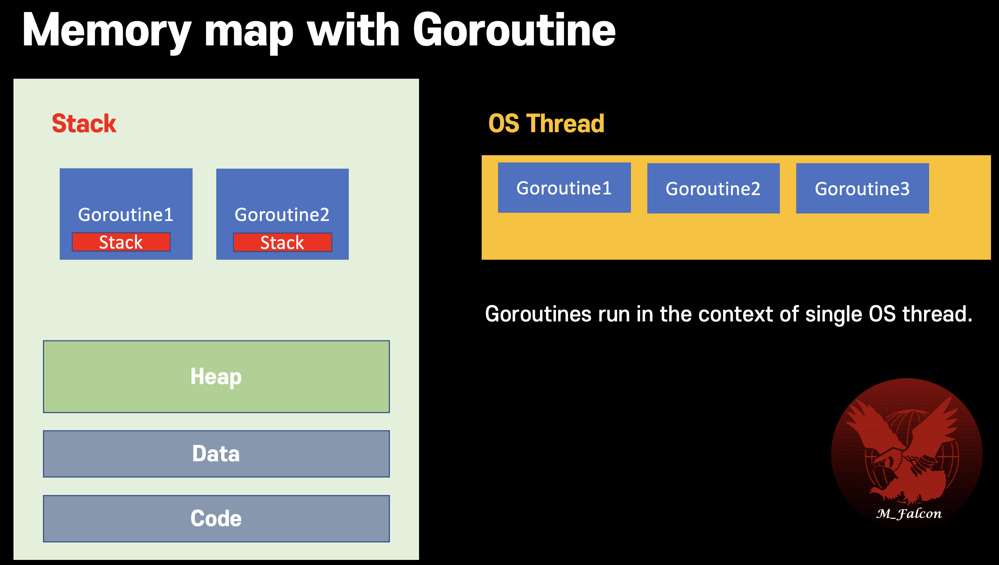

# Goroutine
## Old concurrency problem
- Race condition <br></br>
  This occurs when order of execution is not guaranteed.
- Deadlock <br></br>
  Concurrent program has risk of Blocking.


Expect next program output. <br></br>
It shows race condition , _this program output is different whenever execution._
```go
package goroutine

import (
	"log"
	"testing"
)

func TestGoroutine(t *testing.T) {
	var sharedData int = 0

	go func() {
		sharedData++
	}()

	if sharedData == 0 { // if goroutine gets scheduled after this line
		// sharedData is already '1' incremented from 0
		log.Printf("Data is %v", sharedData) // print 1
	}
}
```

## Solution
Locking mechanism (e.g. Mutex, Semaphore)

## Limit of locking
1. Reduce performance, parallelism since it forces to execute sequentially
2. Deadlock risk if there's circular reference.

---

## Communicating Sequential Process (CSP)
- Each process is built for sequential execution.
- Data is communicated between processes. <br></br>
  **_No shared memory_** <br></br>
  => This protects from deadlock or race condition.
- Scale by adding more of the same.

---


# Concurrency in go
## Goroutines
Goroutine is user space light-weight thread managed by go runtime. <br></br>
Goroutines starts with 2KB of stack whcih grows and shrinks as required. <br></br>
Can create hundreds of thousdands of goroutines in the same address space. <br></br>
Goroutine doesn't use shared memory to avoid deadlock or race condition problem.

> Goroutine is different to thread. <br></br>
> This is running in the context of the OS threads.
> Many goroutines can be executed in the context of the single OS thread.

### Memory map of goroutine


## WaitGroup
#### Wrong example
**_Calling `WaitGroup.Add()` in function is bad approach._** <br></br>
If goroutine failed to get scheduling, then main routine return without blocking leaving goroutine is not executed.

```go
func asyncDoSomething(wg *sync.WaitGroup) {
	wg.Add(1)       // ❌ increment is not executed if goroutine couldn't have the chance to be executed.
	defer wg.Done() // decrement dynamically
    // ..
}

func main() {
  	waitGroup := &sync.WaitGroup{}
    go asyncDoSomething(waitGroup)
    waitGroup.Wait()
}
```

#### Right example
> Always use `waitGroup.add()` outside of goroutine function. <br></br>
For goroutine have to have chance to execute.

```go
func asyncDoSomething(wg *sync.WaitGroup) {
	defer wg.Done()
    // ..
}

func main() {
  	waitGroup := &sync.WaitGroup{}
    waitGroup.add(1) // ✅ Enclosure scope add()
    go asyncDoSomething(waitGroup)
    waitGroup.Wait()
}
```


