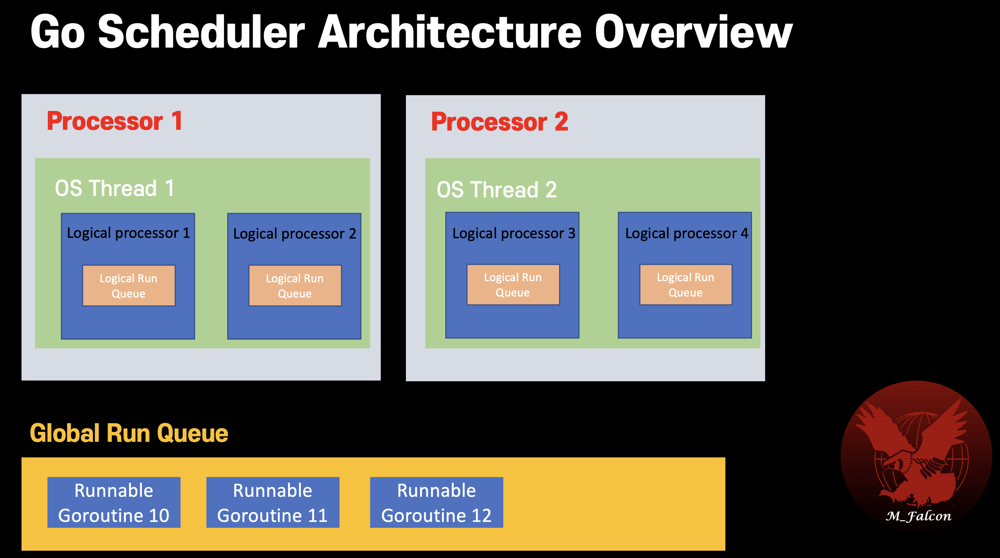
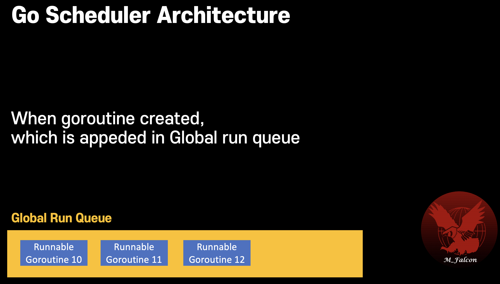
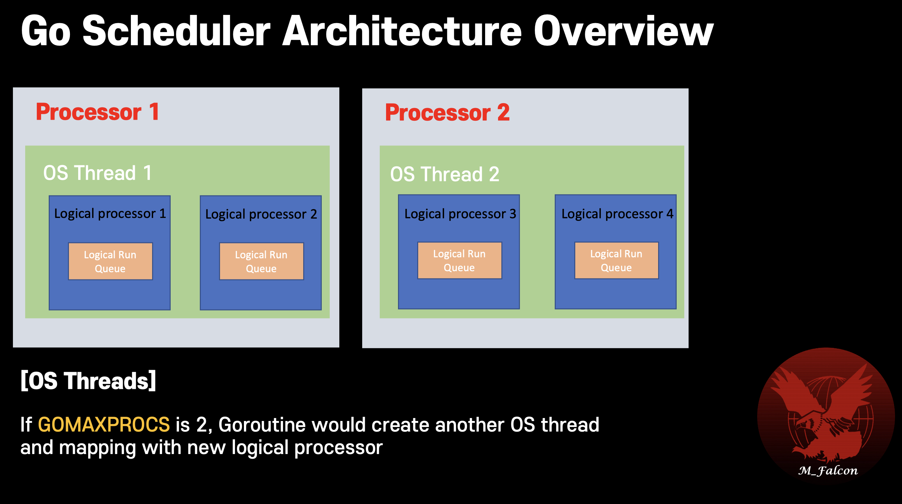
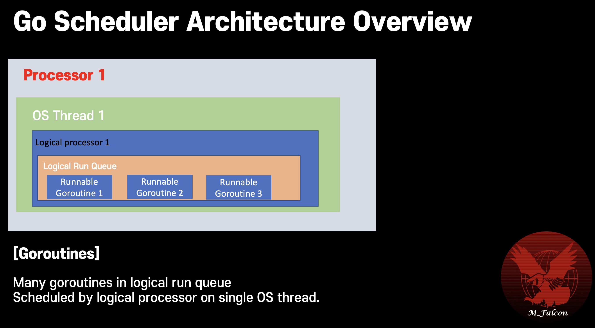

## Scheduling in goroutine
- Go scheduler is a part of the Go runtime. It's known as M:N scheduler.
- Go scheduler runs in user space.
- Go scheduler uses OS threads to schedule goroutines for execution.
- Go runtime creates number of worker OS threads, equal to GOMAXPROCS.   
  GOMAXPROCS : default value is number of processors on machine.
- GO scheduler distrbiutes runnable goroutines over multiple worker OS threads.
- N goroutines could be scheduled on M OS threads that run on at most GOMAXPROCS numbers of processors.
- Time slice `10ms` is set, so when goroutine is running for more than 10ms, Go will try to preempt it. (Asynchronous preemptive scheduling)   
  This is for protecting specific goroutine hog on the CPU for long time.

### Overview

### Global Run Queue

### OS Thread

### Logical Run Queue

**Go scheduler periodically checks each logical run queue of logical processor and reassigns the goroutines as needed to balance the load.**   
This is mechanism of load balancing protecting specific logical processor from being overloaded.   
In other world, each logical processor has logical run queue, and which can take other one's goroutines when it's idle.