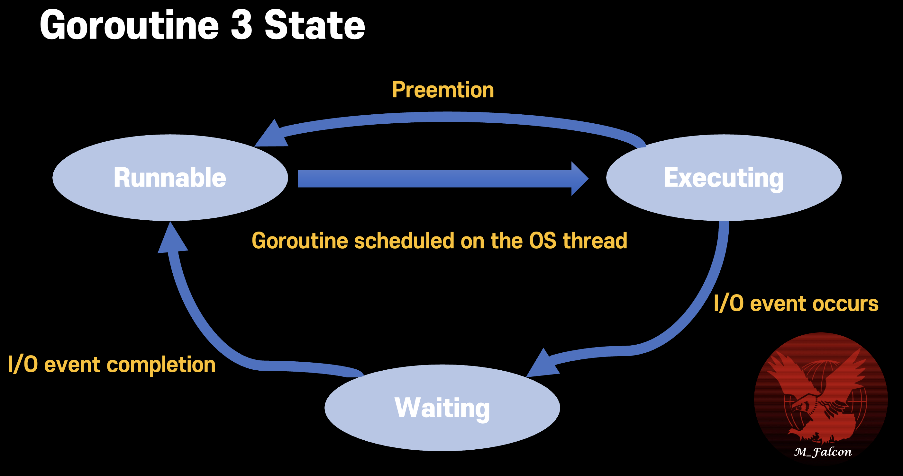

## State of goroutine

### Runnable
Wait in the run queue.

### Executing
Running state on OS thread   
Runnable state to Executing state when preempted by scheduler as time goes by more than time slice (Default `10 ms`).

### Waiting
Waiting state
Running state to this state when I/O or event wait (e.g. blocked on channel, blocked on a system call or waiting for the mutex lock)   
After I/O or event completes, moved back to the runnable state.

