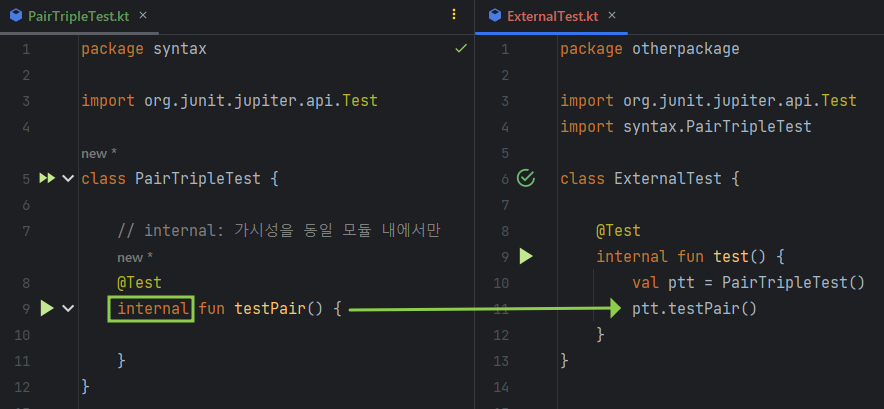

# Access Modifier

## `internal`
동일 '모듈' 내에서만 접근할 수 있게하는 지시자. 

> ⚠️ _Java에는 존재하지 않음._

## Example
#### Directory Structure

#### protected.it

서로 다른 패키지에서 접근 불가능.

#### internal.kt

동일 모듈 내에서 접근 가능

## What's Module in kotlin?
_"A module is a set of Kotlin files compiled together."_

한번에 컴파일되는 코틀린 파일의 집합

### 동일 모듈의 예
Intellij IDEA 모듈

---

## Reference
- [Kotlin docs - module](https://kotlinlang.org/docs/visibility-modifiers.html#modules)