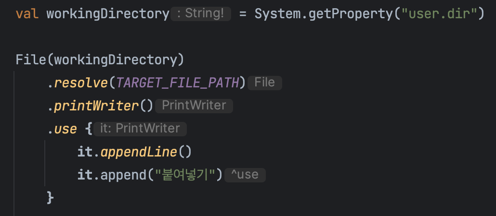

### WriteText.kt
```kotlin
const val TARGET_FILE_PATH = "kotorial_target.txt"

fun main() {
    val workingDirectory = System.getProperty("user.dir")

    File(workingDirectory)
        .resolve(TARGET_FILE_PATH)
        .appendText("\n") // return type 'Unit'
        // ❌ Error occurs
        // highlight-next-line
        .appendText("붙여넣기", Charset.defaultCharset())
}
```

### WriteText.kt
Use apply for return itself. <br></br>
You can do method chaining even though it's not builder pattern class.

```kotlin
const val TARGET_FILE_PATH = "kotorial_target.txt"

fun main() {
    val workingDirectory = System.getProperty("user.dir")

    File(workingDirectory)
        .resolve(TARGET_FILE_PATH)
        .apply {
            appendText("\n")
            appendText("붙여넣기", Charset.defaultCharset())
        }
}
```


#### Closable.kt
```kotlin
/**
 * Executes the given [block] function on this resource and then closes it down correctly whether an exception
 * is thrown or not.
 *
 * @param block a function to process this [Closeable] resource.
 * @return the result of [block] function invoked on this resource.
 */
@InlineOnly
@RequireKotlin("1.2", versionKind = RequireKotlinVersionKind.COMPILER_VERSION, message = "Requires newer compiler version to be inlined correctly.")
public inline fun <T : Closeable?, R> T.use(block: (T) -> R): R {
    contract {
        callsInPlace(block, InvocationKind.EXACTLY_ONCE)
    }
    var exception: Throwable? = null
    try {
        // highlight-next-line
        return block(this) // can be chained.
    }
    // ..
}
```

#### PrintWriter.java
```java
public class PrintWriter extends Writer {
    // ..
    public PrintWriter append(CharSequence csq) {
        write(String.valueOf(csq));
        return this;
    }
}
```

### WriteTextWithUse.kt
```kotlin

fun main() {
    val workingDirectory = System.getProperty("user.dir")
    
    File(workingDirectory)
        .resolve(TARGET_FILE_PATH)
        .printWriter() // return PrintWriter
        // public inline fun <T : Closeable?, R> T.use(block: (T) -> R): R
        // T: PrintWriter
        .use {  // writer is PrintWriter
            it
              .appendLine()
              .append("붙여넣기") // append return itself
        }
}
```




