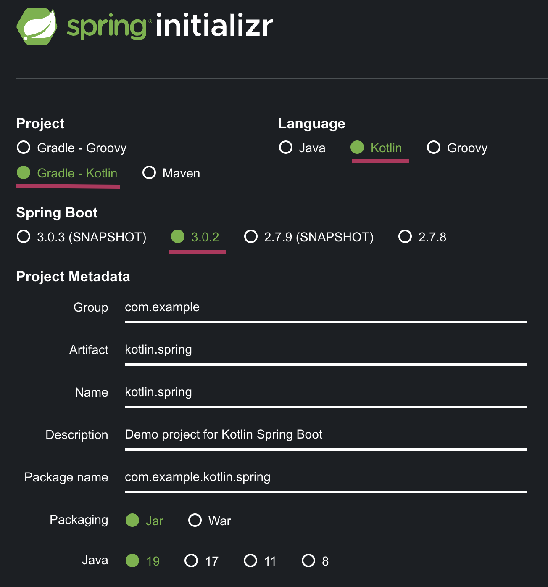
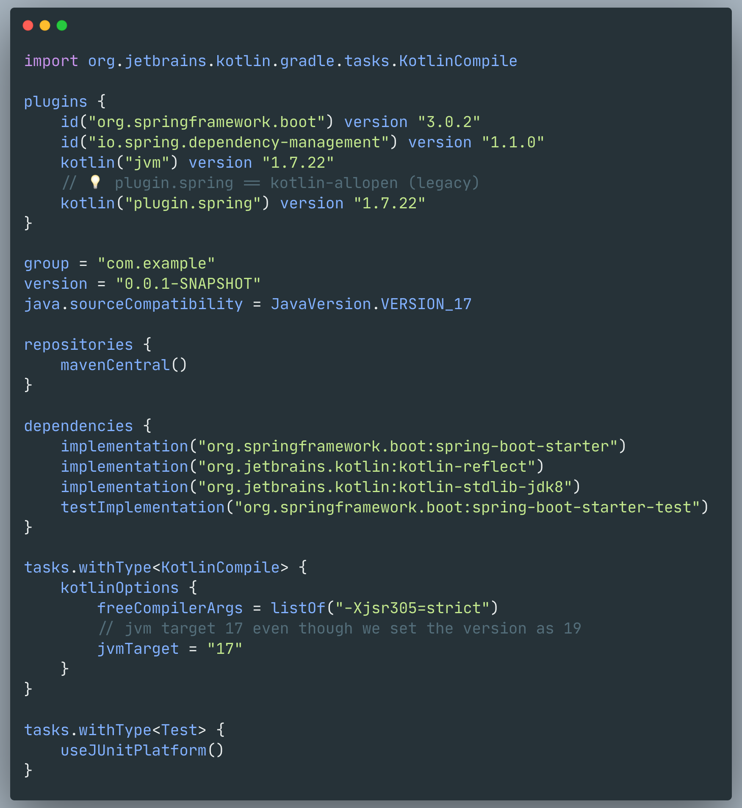
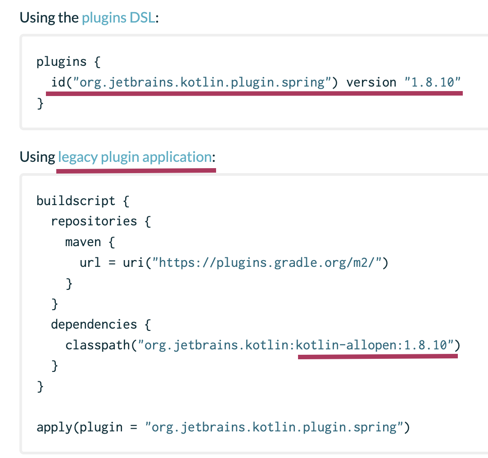

### Spring initializr

### build.gradle.kts

### What's the role of plugin.spring?
Spring uses proxy pattern. This pattern requires inheritance so all spring bean classes have to be `open`.   
That plugin automatically adds `open` keyword when we add annotation on classes. (e.g. `@Component`, `@Transactional`)

### build.gradle document

    

### 🔗 Reference
- [Kotlin + Spring setting - github.io](https://cheese10yun.github.io/spring-kotlin/)
- [Spring Support - Kotlin official docs](https://kotlinlang.org/docs/all-open-plugin.html#spring-support)