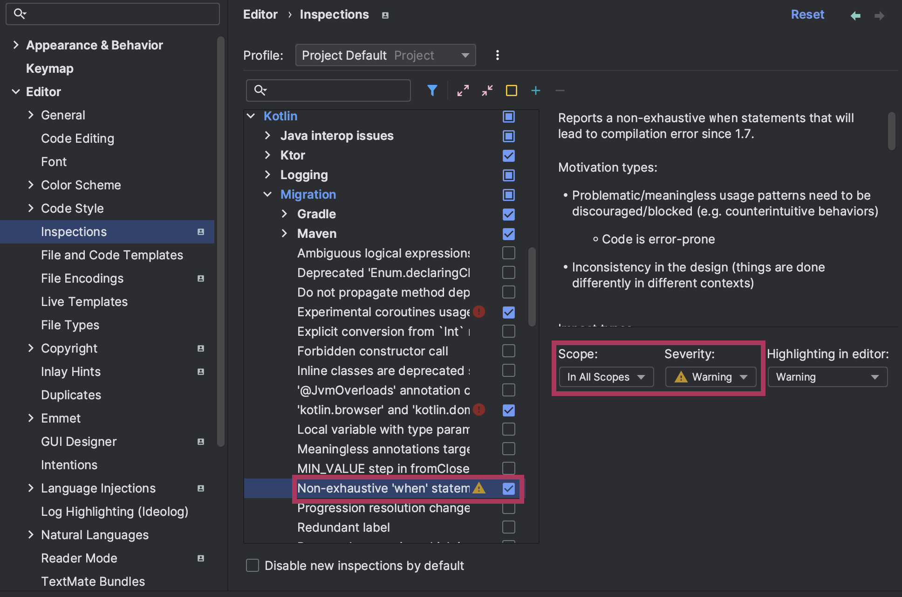

## 버전 확인
2023-02-17 Latest verion is `v1.8.10`
```kotlin
fun main(args: Array<String>) {
    // 현재 버전 확인
    println("Current version of kotlin : ${KotlinVersion.CURRENT}")

    // 최소 버전 확인 (major, minor, patch)
    println(KotlinVersion.CURRENT.isAtLeast(1, 7, 1)) // true
}
```

## 람다식 실행 횟수 지정
[repeat example](https://kotlinlang.org/api/latest/jvm/stdlib/kotlin/repeat.html)

## when 사용 강제
switch - case 에서 default: 를 지정해 모든 케이스를 커버하는 것 처럼 <br></br>
when 절에도 else 사용을 강제하게끔 하는 기법이 있다.

```kotlin
fun main(args: Array<String>) {
    val n : Int = 3
    when (n % 3) {
        0 -> println("$n % 3 == 0")
        1 -> println("$n % 3 == 1")
        2 -> println("$n % 3 == 2")
        // ⚠️ else 문 없어도 오류 X
    }
}
```

### 객체 자신을 리턴하는 커스텀 get() 속성 추가
```kotlin
val <T> T.exhaustive: T
    get() = this

fun main(args: Array<String>) {
    val n : Int = 3
    when (n % 3) {
        0 -> println("$n % 3 == 0")
        1 -> println("$n % 3 == 1")
        2 -> println("$n % 3 == 2")
        // ⚠️ 'when' expression must be exhaustive, add necessary 'else' branc
        // highlight-next-line
    }.exhaustive
}
```

### Intellij IDEA 를 통한 스마트한 방법
**Kotlin 1.7 버전 이후부터 사용 가능하다.**

모든 케이스에 적용되는 완벽한 방법은 아니다. <br></br>
컴파일러가 워낙 똑똑해져서, 별도의 Warning , Error 메시지를 뿜지 않고 알아서 `else-> {}` 구문을 추가해주기도 한다.

:::info
**kotlin 1.6 버전부터 enum, sealed, boolean 에 대해서는 자동으로 모든 케이스 커버를 강제한다.**
:::
```kotlin
enum class Currency {
    WON,
    DOLLAR,
    BTC
}

fun main(){
    val currency = Currency.WON
    when(currency) { 
        Currency.WON -> "₩"
        Currency.DOLLAR -> "$"
        // ⚠ Error: ️'when' expression must be exhaustive
        // highlight-next-line
        // else-> {}
    }
}
```
`else` 혹은 `Currency.BTC` 를 추가해야한다.

:::tip
enum class 의 경우 when 절에서 else 로 모든 케이스를 커버하는 것은 좋은 코드가 아니다. <br></br>
오히려 else 구분을 빼놓고 모든 케이스를 명시해놓아야 추가 케이스가 등장할 때 정확히 대응할 수 있다.
:::

### Kotlin release
- [Kotlin release note - docs](https://kotlinlang.org/docs/releases.html)
- [Kotlin exhaustive when - docs](https://kotlinlang.org/docs/whatsnew16.html#stable-exhaustive-when-statements-for-enum-sealed-and-boolean-subjects)
