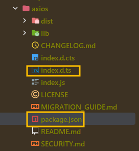

import Tabs from '@theme/Tabs';
import TabItem from '@theme/TabItem';

# .d.ts
Why .d.ts file is used? when to use? <br></br>

## When to use
- Type declaration
- Use javascript library in typescript

**.d.ts file doesn't generate .js file**

## Why to use?
Many packages are written by javascript.
If package wouldn't have type definition file  <br></br>
We can use it and find type in typescript project <br></br>

:::info
`.d.ts` file allow using a package with type on typescript project even though that package is written by javascript.
:::

## Contents
Almost of all codes which are consists of namespace, interface, type, and method signature.

## How to use?
Show you [axios](https://github.com/axios/axios) example `index.d.ts`

You can find this on `node_modules/axios` <br></br>



<Tabs>
<TabItem value="axios-type" label="index.d.ts">


```typescript

interface AxiosResponse<T = any, D = any>  {
    data: T;
    status: number;
    statusText: string;
    headers: RawAxiosResponseHeaders | AxiosResponseHeaders;
    config: InternalAxiosRequestConfig<D>;
    request?: any;
}

export type Method =
    | 'get' | 'GET'
    | 'delete' | 'DELETE'
    | 'head' | 'HEAD'
    | 'options' | 'OPTIONS'
    | 'post' | 'POST'
    | 'put' | 'PUT'
    | 'patch' | 'PATCH'
    | 'purge' | 'PURGE'
    | 'link' | 'LINK'
    | 'unlink' | 'UNLINK';

// ..

declare const axios: AxiosStatic;

export default axios;
```
</TabItem>
<TabItem value="usage axios" label="axios.test.ts">

`.d.ts` file already exists on 'axios' (index.d.ts)
So we don't need additional tasks when to use this.

```typescript
import axios, {AxiosResponse} from 'axios'

// package.json tells typescript where to find the types from module.
// So we can find type declaration.
axios.get('https://localhost:8080')
    // AxiosResponse type is provided by index.d.ts
    .then((res: AxiosResponse) =>{
        console.log(res.status)
    })

```
</TabItem>
</Tabs>


### How typescript compiler know type of any module?
![axios package.json]
In package.json, in there `types` is defined.  

#### package.json
In axios, type is defined as shown below. <br></br>
So, we don't need to install `@types/axios` module for typescript project.
```.json
{
  "name": "axios",
  "version": "1.3.4",
  "description": "Promise based HTTP client for the browser and node.js",
  "main": "index.js",
// .. 
  },
  "type": "module", 
  "types": "index.d.ts", // ✅ Let tsc know type from axios package.
}
```

:::tip
If the package doesn't have `.d.ts` file , you have to add @types/${package-name} on package.json (normally the name of which is `index.d.ts`) <br></br>
Also, if @types/* not exists too? and then you should create `.d.ts` for using it with type in typescript project.
:::

### Advantage
1. comes with its advantage
2. Generic + interface => TSC infer type flexibly

#### AxiosResponseType.test.ts

```typescript
import axios, {AxiosResponse} from 'axios'

interface User {
    id: number
    name: string
    email: string
    address: {
        street: string
        suite: string
        city: string
        zipcode: string
        geo: {
            lat: string
            lng: string
        }
    },
    phone: string
    website: string
    company: {
        name: string
        catchPhrase: string
        bs: string
    }
}

axios
    // get<T = any, R = axios.AxiosResponse<T>, D = any>(url: string, config?: axios.AxiosRequestConfig<D>): Promise<R>;
    // T: User => R: AxiosResponse<User
    .get<User>('https://jsonplaceholder.typicode.com/users/1')
    .then((res)=>{
        // user's type is interpreted as User
        const user = res.data
        console.dir(user)
    })
    .catch(console.error)

axios
    .get('https://jsonplaceholder.typicode.com/users')
    .then((res: AxiosResponse<User[]>)=>{
        // user's type is interpreted as User
        // Typescript anticipate response data type is User[]
        const users = res.data
        console.dir(users)
    })
    .catch(console.error)
})
```

## Tips
If `index.d.ts` file doesn't exist, you could find `@types/{package-name}` on [DefinitelyTyped github](https://github.com/DefinitelyTyped/DefinitelyTyped).
