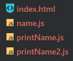
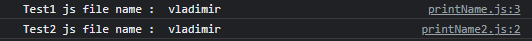
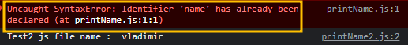
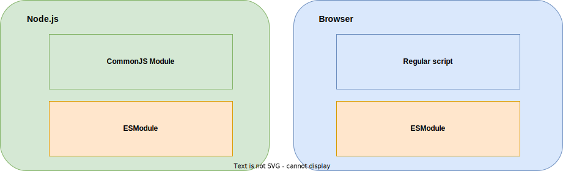

import Tabs from '@theme/Tabs';
import TabItem from '@theme/TabItem';

## Modules
namespace is almost deprecated. it appeared before ESModule system is accepted. <br></br>
Instead, Use module system with `export/import` (ESModule) or `exports, require` (CommonJS)


## Why to use module?
**Separate and organize the javascript & typescript code** <br></br>
In origin, javascript is used for only browser. <br></br>
At first, you need to understand Global scope what it is.

## Global scope
You must have ever seen `<script>` in html , in javascript, you can declare function and use it without separating module, namespace.

<Tabs>
<TabItem value="name" label="name.js">

`name.js` only has `name` variable.
```javascript
// This is global scope
const name = 'vladimir'
```
</TabItem>
<TabItem value="printName" label="printName.js">

```javascript
console.log('Test1 name : ', name)
```
</TabItem>
<TabItem value="printName2" label="printName2.js">

```javascript
console.log('Test2 name : ', name)
```
</TabItem>
</Tabs>

In html file, `name` is shared all over since it's global scope

#### index.html
```html
<!DOCTYPE html>
<html lang="en">
<head>
    <meta charset="UTF-8">
    <title>Title</title>
</head>
<body>
variable `name` has global scope
<script src="name.js"></script>
<script src="printName.js"></script>
<script src="printName2.js"></script>
</body>
</html>
```

#### File list


#### Result
console output:



If you redeclare `name` in another js it must be fail. Suppose redeclare it in printName
#### printName.js
```javascript
// redeclaration
// highlight-next-line
const name = 'vladimir'
console.log('Test1 js file name : ', name)
```

This code error occurs
```log
Uncaught SyntaxError: Identifier 'name' has already been declared (at printName.js:1:1)
```




## How to resolve it?
Use module export/import . It is declaration that _"This file is module"_. not of global scope one.


# Module system between Node.js and browser


Node.js uses CommonJS from starting with `require/exports`. <br></br>
However, the browser doesn't support CommonJS module. At first, use `<script>` (standard script) without module system. <br></br>
and now Support modern module system with `import/export` <br></br>
Let's see how to use it.

#### HTML Tag
```html
<body>
    <script type="module" src="./dist/index.js"></script>
</body>
```

But maybe meet errors since there's CORS policy of browser.
```log
Get file:///Users~~~/dist/index.js net::ERR_FAILED
```

> You need to pay attention to local testing <br></br>
> if you try to load the HTML file locally (i.e. with a file:// URL), <br></br> 
> **you'll run into CORS errors due to JavaScript module security requirements**. <br></br>
> _- MDN docs_


#### tsconfig.json
```json
{
  "module": "ES6"  
}
```

This means that We're serving anything and trying to use file protocol.
```bash
# From this, html file served from the server (HTTP) instead of `file`
$ yarn install lite-server
$ yarn start
```

:::tip
Use modern ES Module using tsconfig and script with `module` property and server.
Or use bundle library like [browserify](https://github.com/browserify/browserify)
:::


## Reference
- [Typescript handbook docs](https://www.typescriptlang.org/docs/handbook/2/modules.html#non-modules)
- [Javascript module - MDN docs](https://developer.mozilla.org/en-US/docs/Web/JavaScript/Guide/Modules#applying_the_module_to_your_html)
